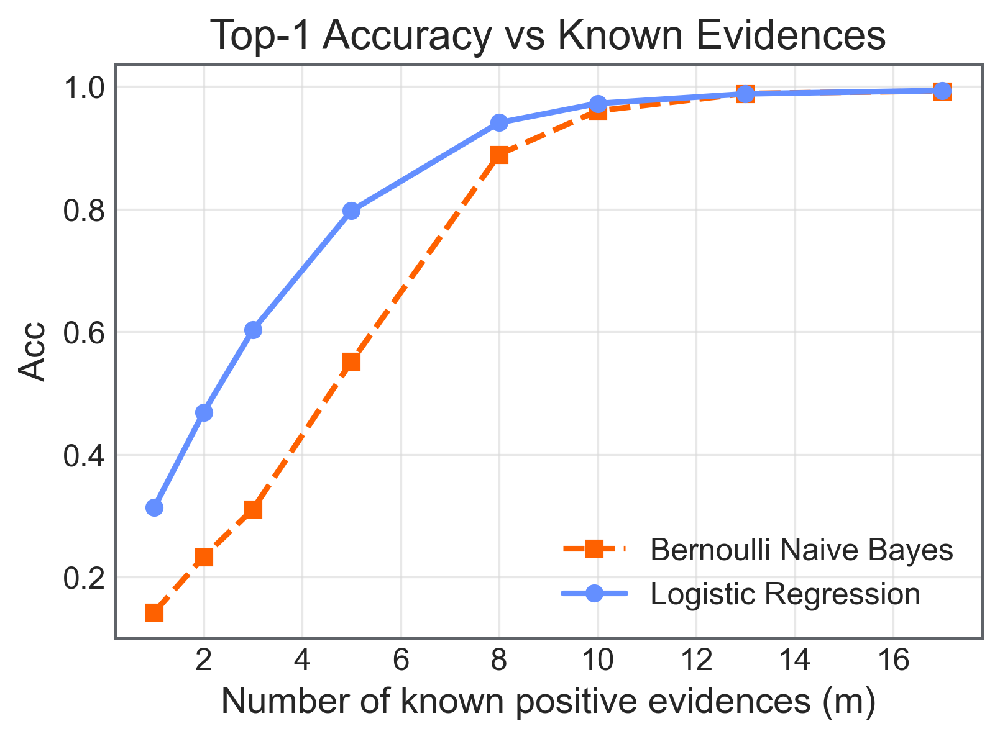
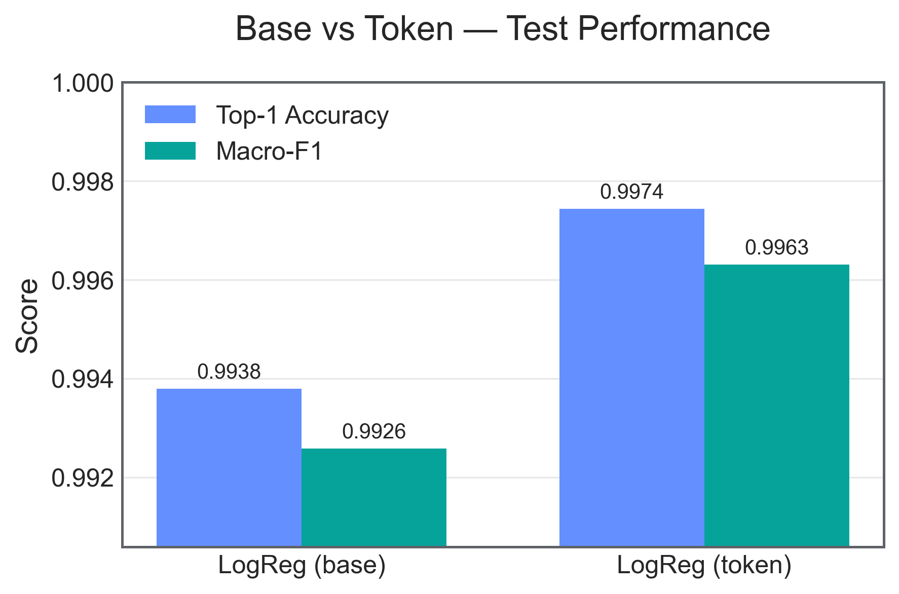
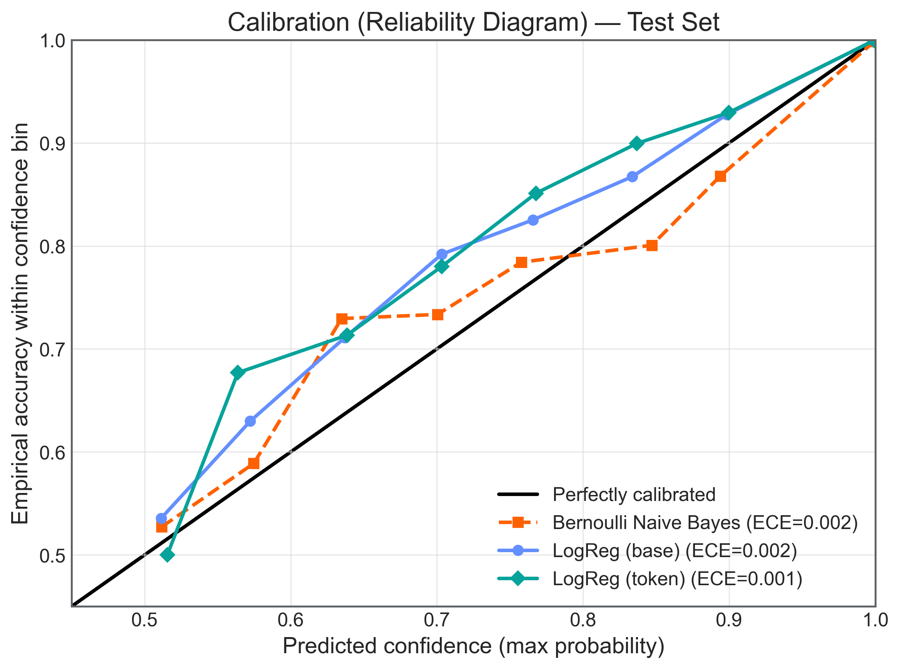
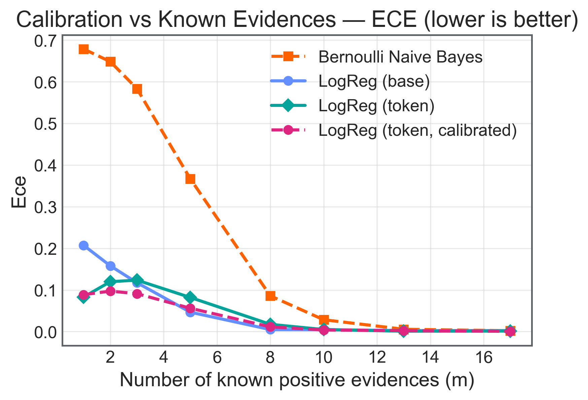

# Diagnostic Reasoning Assistant (Bootcamp Final Project)

An AI-powered **educational** diagnostic reasoning assistant that supports medical students and junior clinicians by:
1) ranking differential diagnoses from structured evidence, and
2) refining them through iterative questioning using a **base-level information-gain policy**, and
3) providing **grounded, local-only explanations** via TF‑IDF retrieval (RAG-style explanations without LLM calls).

> **Disclaimer:** Educational tool only. Not medical advice. Not intended for direct patient care.

---

## Project status
✅ **MVP complete (March 2026)**

The MVP includes:
- Token/value-level diagnosis ranking (Logistic Regression)
- Base-level question selection (information-gain policy)
- Local TF‑IDF retrieval for explanations (evidence definitions + condition metadata + mini‑manual)
- Streamlit demo app (`app.py`) using reusable logic in `src/rag.py`

**Planned next (post-submission):** evaluation extensions (more models/features), UI polish (session export), and optional LLM *rewriting* layer (kept strictly separate from prediction).

---

## Architecture (MVP)
**Per turn:**
1. Update session state (age/sex + answered evidences)
2. Predict Top‑k diagnoses using the trained **token model**
3. Select next base evidence via **information gain**
4. Retrieve supporting context locally (TF‑IDF)
5. Render explanations (collapsible in notebook; expanders in Streamlit)

**Non-negotiable constraints (by design):**
- No retraining during inference
- No external APIs / no live PubMed / no LLM calls
- Local TF‑IDF retrieval only
- Safety disclaimer on user-facing screens

---

## Key results (current best)
### Best model: Logistic Regression with token/value-level evidence encoding
- Evidence representation:
  - **Base encoding:** 223 evidence bases
  - **Token encoding:** 972 value-level tokens (e.g., `E_55=V_29`)
- Full test set performance:
  - **LogReg (base):** Top‑1 ≈ 0.9938, Macro‑F1 ≈ 0.9926
  - **LogReg (token):** Top‑1 ≈ 0.9974, Macro‑F1 ≈ 0.9963  
- Token encoding significantly reduces clinically meaningful confusions, including acute vs chronic rhinosinusitis.

### Calibration (probability quality)
We evaluated probability calibration using:
- multiclass log-loss (lower is better)
- ECE (Expected Calibration Error; 0 is perfect)

All three models are near-diagonal on reliability plots with very low ECE (~0.001–0.002). Token LogReg is best overall (lowest log-loss and ECE).

---

## Selected figures
### Interactive setting: Accuracy vs evidence budget
Top‑1 accuracy vs number of known positive evidences (m):


### Token encoding improvement (headline metrics)


### Error analysis: biggest confusion reductions


### Calibration (reliability diagram)


### Calibration vs known evidences — ECE


---

## What was added for the MVP (RAG explanations + Streamlit)
### Notebook 03: RAG explanations (offline)
Notebook 03 builds a local retrieval layer and validates explanations:
- Builds **mini‑manual** markdown docs for each condition (49 files)
- Builds canonical TF‑IDF retriever: `outputs/rag/tfidf_retriever.joblib`
- Integrates explanations into the demo loop:
  - `explain_topk_diagnoses()`
  - `explain_next_question()`
- Saves complete demo traces (including explanations) to JSON

### Streamlit demo app
- `app.py` provides an interactive Q&A UI
- `src/rag.py` packages the reusable logic:
  - artifact loading (`load_resources()`)
  - evidence translation + clustering for initial input
  - `assistant_step()` (predict → update posterior with negatives → choose next question)
  - explanation builders

---

## Deployment artifacts (no retraining required)
The deployed assistant loads pre-trained artifacts from `models/`:
- Token Logistic Regression model (prefer calibrated if present)
  - e.g., `models/logreg_token_calibrated.joblib` (or a raw token LR fallback)
- Preprocessors bundle (preferred): `models/preprocessors.joblib` containing:
  - `mlb_base`, `mlb_token`, `ohe`, `scaler`, `label_encoder`
  - feature metadata (column lists / feature names)
- Policy artifacts: `models/policy_artifacts.joblib`

**RAG / explanation artifacts written to `outputs/rag/`:**
- `outputs/rag/tfidf_retriever.joblib`
- `outputs/rag/mini_manual/index.json`
- `outputs/rag/mini_manual/*.md` (49 docs)
- `outputs/rag/demo_trace_log.json`
- `outputs/rag/ambiguous_seed_demo_log.json`
- `outputs/rag/evidence_clusters.json` (UI-only clustering for initial findings)

> Note: If any `.joblib` artifacts exceed GitHub file size limits, use Git LFS.

---

## Dataset
**Primary dataset:** DDXPlus (synthetic clinical cases)
- 1,292,579 synthetic patient cases
- 49 pathologies
- 223 evidence bases (+ 972 token/value-level features)
- Differential diagnosis list included but **not used as a predictive input feature**

**Mapping files (required for MVP runtime)**
- `data/release_evidences.json` (evidence code → question text, type, default value, value meanings)
- `data/release_conditions.json` (condition → disease metadata)

> Note: DDXPlus is synthetic, privacy-safe data. Results reflect in-dataset performance and may not generalize to real clinical populations.

---

## Technologies
- Python, scikit-learn, joblib
- TF‑IDF retrieval (local corpus)
- Streamlit (interactive demo app)

---

## Repository structure
```text
.
├── app.py
├── notebooks/
│   ├── 01_data_exploration.ipynb
│   ├── 02_model_development.ipynb
│   └── 03_rag_explanations_ddxplus.ipynb
├── src/
│   ├── __init__.py
│   ├── artifacts.py
│   ├── encoding.py
│   ├── inference.py
│   ├── policy.py
│   ├── rag.py
│   ├── types.py
│   └── condition_enrichments.py
├── data/
│   ├── release_evidences.json
│   └── release_conditions.json
├── figures/
│   ├── eda/
│   └── ml/
├── outputs/
│   ├── eda/
│   ├── ml/
│   └── rag/
├── models/
|── Diagnostc_Assistant.pdf     # project presentation
├── requirements.txt
└── README.md
```

---

## Quickstart (MVP)
### 1) Install dependencies
```bash
pip install -r requirements.txt
```

### 2) Ensure required files exist
- `data/release_evidences.json`
- `data/release_conditions.json`
- `models/preprocessors.joblib` (or `models/preprocessors_token.joblib`)
- `models/policy_artifacts.joblib`
- token LR model artifact (prefer calibrated if available)

### 3) Run the Streamlit app
```bash
streamlit run app.py
```

### 4) (Optional) Rebuild the RAG artifacts + validate explanations
Run the notebooks in order:
- `01_data_exploration.ipynb`
- `02_model_development.ipynb`
- `03_rag_explanations_ddxplus_SUBMISSION.ipynb`

Outputs:
- Figures saved to `figures/`
- Tables saved to `outputs/`
- Trained models saved to `models/`
- RAG artifacts + demo logs saved to `outputs/rag/`

---

## Known limitations (current build)
- DDXPlus is synthetic and limited to 49 conditions
- Evidence wording can be awkward (dataset-driven); clustering/translation is heuristic (UI-only)
- Model comparison scope is limited (baseline + a small set of experiments)
- Streamlit demo is MVP-level (e.g., session export is a good next enhancement)

---

## Next steps (post-submission)
- Refactor remaining notebook-only helpers into `src/` (keep `src/rag.py` as the reusable interface)
- Improve evidence phrasing + grouping for user-facing clarity
- Add downloadable session summary (JSON + human-readable text)
- Evaluate additional models (e.g., XGBoost) and feature engineering (strictly within the same dataset split)
- Optional: add an LLM **only as a rewriting layer** for UI text (never for prediction)
